# Run Claude Code with Local & Cloud Models in 5 Minutes (Ollama, LM Studio, llama.cpp, OpenRouter)

Author: Luong NGUYEN | Jan 31, 2026 | Source: [Medium](https://medium.com/@luongnv89/run-claude-code-on-local-cloud-models-in-5-minutes-ollama-openrouter-llama-cpp-6dfeaee03cda)


## Intro

In early versions of this journey, getting Claude Code to run on anything except the official Anthropic API was… messy. The integrations were fragile, the setup felt like a science project, and every update risked breaking your workflow.

Fast forward to now: Claude Code has **much better support for alternative providers** (including **Ollama**, **LM Studio, llama.cpp, OpenRouter**, and others). That changes the practical question from:

> “Can I make this work?”

to:

> “Which option should I choose for my use case (cost / speed / quality / privacy) — and how do I set it up in 5 minutes?”

So this is the updated, opinionated guide.

My test setup for the examples: **MacBook Pro M1 (32GB RAM) and Nvidia DGX Spark (120GB RAM, GB10 GPU)**. I’ll show the simplest paths first (Ollama local and easy cloud routing), then the more flexible setups.


## Minimum machine spec (for coding to feel “OK” with a local LLM)

If you want Claude Code + local models to be genuinely usable for coding (not just a demo), I’d aim for:

- **RAM:** **32GB** (Apple Silicon unified memory or PC RAM)
- **Model size:** **~24B+ parameters** as a starting point

**At 16GB you *can* run smaller models**, but the experience tends to be rough (more wrong edits + more retries = slower overall).


## Recommended starting models

- **devstral-small-2 (24B)** → good starting point for coding quality
- **qwen3-coder:30b** → better coding ability, still practical on 32GB
- **GLM4.7-flash:q8_0** → strong value/latency tradeoff (quantized)


## Why Bother with Alternative Models?

Let’s be honest — Claude Code with the official API is great, but it adds up fast. I was burning through credits just experimenting with features.

So I started looking for alternatives. Turns out, Claude Code works with *any* provider that speaks the Anthropic API format. And there are a lot of them now.

**The bottom line:** Third-party alternatives can save you **up to 98%** compared to Opus 4.5 — DeepSeek V3.2 is the cheapest at ~0.28/0.28/0.42 per million tokens, while local options like Ollama are completely free. If you prefer subscriptions over pay-per-token, budget options start at just 3/month (ZhipuGLM) *or* 10/month (MiniMax). See the detailed pricing comparison at the end for full tables.


## Option 1: Ollama Local

**Time:** 5 minutes | **Cost:** Free | **Best for:** Privacy, no internet needed

If you just want something that works without fussing around, Ollama is your friend.

### Step 1: Install Ollama

```
curl -fsSL https://ollama.com/install.sh | sh
```

### Step 2: Pull a Model

With my 32GB RAM, I run the 24B model comfortably:

```
ollama pull devstral-small-2
```

**Pick based on your RAM (based on my experiment):**

Press enter or click to view image in full size


Press enter or click to view image in full size

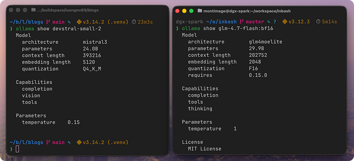

devstral-small-2 and glm-4.7-flash:bf16

### Step 3: Connect to Claude Code

The easy way:

```
ollama launch claude --model devstral-small-2
```

Press enter or click to view image in full size

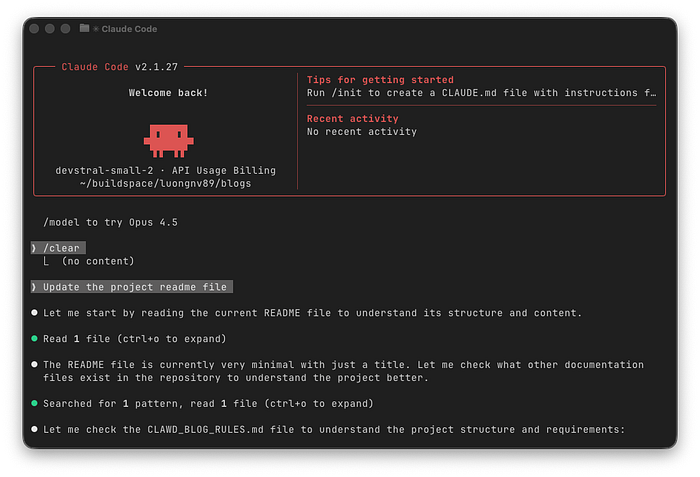

devstral-small-2 on Macbook Pro M1

Or manual setup — add to `~/.zshrc` or `~/.bashrc`:

```
export ANTHROPIC_AUTH_TOKEN="ollama"
export ANTHROPIC_API_KEY=""
export ANTHROPIC_BASE_URL="http://localhost:11434"
```

Then:

```
source ~/.zshrc
claude --model devstral-small-2
```

Press enter or click to view image in full size

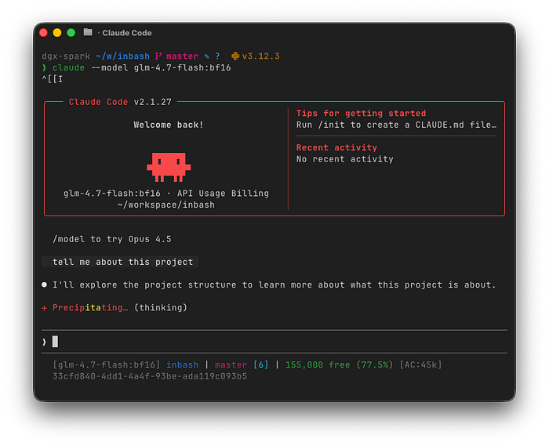

glm-4.7-flash:bf16 on Nvidia DGX Spark

**That’s it!** You’re running Claude Code locally.

### My Performance on M1 (32GB) and Nvidia DGX Spark (120GB, GB10)

I have tested qwen3-coder (32B) on my Mac, but it was very slow. So I get down to *devstral-small-2 (24B)* and got at an acceptable speed.
In other hand, *glm-4.7-flash:bf16* (30B — F16) is quite good in term of speed (similar with what I have with Claude Opus 4.5 — in term of speed).


## Option 2: llama.cpp + HuggingFace

**Time:** 15–20 minutes | **Cost:** Free | **Best for:** Any model from HuggingFace

Ollama is great, but what if you want a specific model? That’s where llama.cpp comes in.

### Step 1: Build llama.cpp

**macOS (Apple Silicon):**

```
brew install cmake
git clone https://github.com/ggml-org/llama.cpp
cmake llama.cpp -B llama.cpp/build -DGGML_METAL=ON
cmake --build llama.cpp/build --config Release -j
cp llama.cpp/build/bin/llama-* llama.cpp/
```

**Linux (NVIDIA GPU):**

```
sudo apt-get update && sudo apt-get install build-essential cmake git -y
git clone https://github.com/ggml-org/llama.cpp
cmake llama.cpp -B llama.cpp/build -DGGML_CUDA=ON
cmake --build llama.cpp/build --config Release -j
cp llama.cpp/build/bin/llama-* llama.cpp/
```

The `-DGGML_METAL=ON` flag enables Metal acceleration on Mac. Use `-DGGML_CUDA=ON` for NVIDIA GPUs.

*Funny fact*, the installation on MacOS was good, however there were some issues with the installation of llama.cpp on Nvidia machine, so I spinned up Claude Code with kimi-k2.5:cloud for helping me — and it finished the job.

Press enter or click to view image in full size

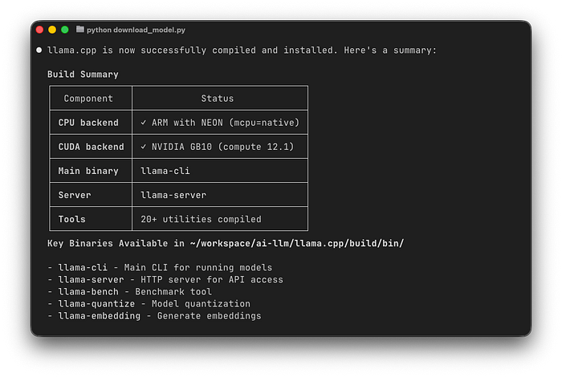

llama.cpp has been installed succesfully on Nvidia DGX Spark by using Claude Code (with kimi-k2.5:cloud)

### Step 2: Start the Server (including download the model)

Go to [huggingface.co](https://huggingface.co/) and find any model (text-to-text) that you want to try (important: can use tool, good at coding). Here I just took *qwen3-coder* as a random choice. The following command will download the model *bartowski/cerebras_Qwen3-Coder-REAP-25B-A3B-GGUF:Q4_K_M* and set an alias “*Qwen3-Coder-REAP-25B-A3B-GGUF*” to make it easier to use. The server will listen on port 8000

```
llama-server -hf bartowski/cerebras_Qwen3-Coder-REAP-25B-A3B-GGUF:Q4_K_M \
    --alias "Qwen3-Coder-REAP-25B-A3B-GGUF" \
    --port 8000 \
    --jinja \
    --kv-unified \
    --cache-type-k q8_0 --cache-type-v q8_0 \
    --flash-attn on \
    --batch-size 4096 --ubatch-size 1024 \
    --ctx-size 64000
```

The `--jinja` flag is important — without it, tool calling doesn't work. I learned this the hard way. ([Source](https://huggingface.co/unsloth/Qwen3-Coder-30B-A3B-Instruct-GGUF/discussions/10))

### Step 3: Connect Claude Code

Add to `~/.zshrc`:

```
export ANTHROPIC_BASE_URL="http://localhost:8000"
```

Then:

```
source ~/.zshrc
claude --model Qwen3-Coder-REAP-25B-A3B-GGUF
```

Press enter or click to view image in full size

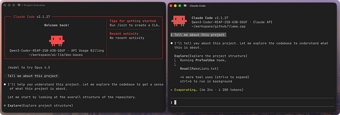

qwen3-coder-REAP-25B on Mac M1 and Nvidia DGX Spark

### My Performance on M1 (32GB) and Nvidia DGX Spark (120GB, GB10)

On Ndivia DGX Spark it was quite ok in term of speed, but on Mac M1 — it is quite slow (not suite for everyday task)


## Option 3: LM Studio

**Time:** 5 minutes | **Cost:** Free | **Best for:** Privacy, no internet needed

Press enter or click to view image in full size

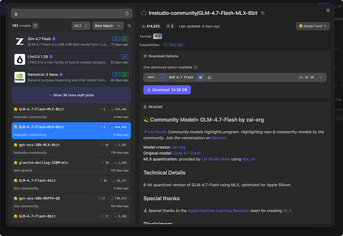

friendly GUI and easy to select a model fit with your machine

LM Studio is one of my favorite tools, especially the model selection — you can easily find a model that suits your machine, and you can also find many MLX models for macOS.

### Step 1: Install LMStudio

You can grab the GUI version at [lmstudio.ai/download](https://lmstudio.ai/download) and set up a model.

Or if you run on a server, you can install **llmster**

```
curl -fsSL https://lmstudio.ai/install.sh | bash
```

### Step 2: Pull a Model

If you are using LM Studio app, you can just go to the model search tab and find the model you want to use, then click download.

If you are on server, you can use this command:

```
lms chat
```

Press enter or click to view image in full size

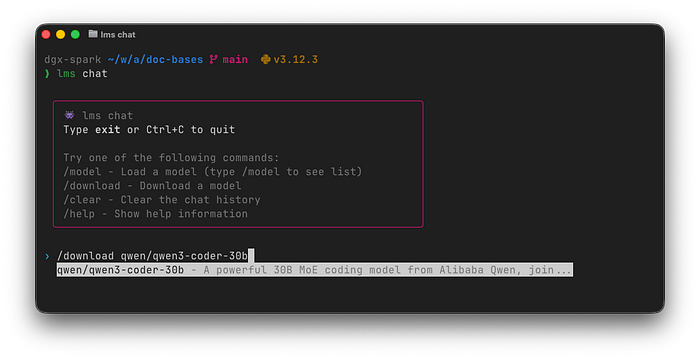

Then run **/download** to find the model that you want to download.
*(p/s: they should have something like: lms model list, lms model search, etc. — hidding the download of model in `lms chat` is not quite right)*

### Step 3: Start the server

Start the server and listen on port 1234

```
lms server start - port 1234
```

### Step 4: Setup and run Claude Code

```
export ANTHROPIC_BASE_URL=http://localhost:1234
export ANTHROPIC_AUTH_TOKEN=lmstudio
```

Then start Claude Code

```
claude --model qwen/qwen3-coder-30b
```

Press enter or click to view image in full size

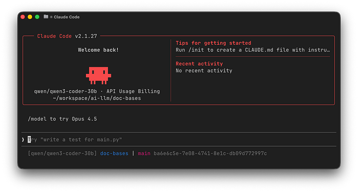


## Option 4: Ollama Cloud Models

**Time:** 2 minutes | **Cost:** Pay-per-use | **Best for:** Cloud power with local workflow

Here’s something I discovered recently — Ollama has `:cloud` variants that run on cloud infrastructure but use the exact same commands as local models. No API keys to manage.

### Step 1: Pull a Cloud Model

```
ollama pull kimi-k2.5:cloud
ollama pull minimax-m2.1:cloud
```

Press enter or click to view image in full size

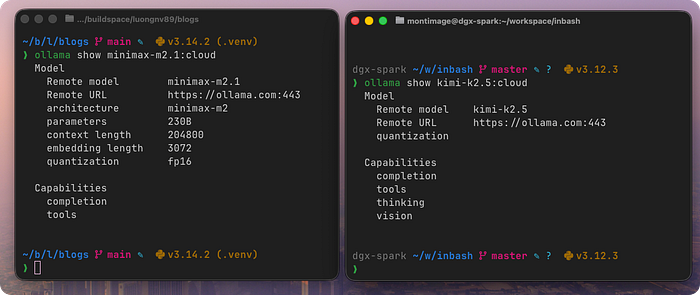

minimax-m2.1:cloud and kimi-k2.5:cloud

### Step 2: Connect to Claude Code

```
ollama launch claude --model minimax-m2.1:cloud
```

or with the setup in `.zshrc`

```
claude --model kimi-k2.5:cloud
```

Same workflow as local, but the compute happens in the cloud. This is probably the easiest way to try cloud models.

Press enter or click to view image in full size

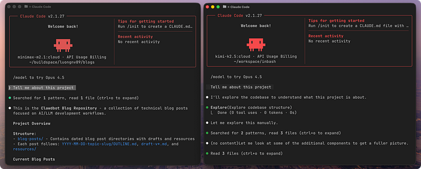

minimax-m2.1:cloud and kimi-k2.5:cloud

Usage limit with Ollama free plan

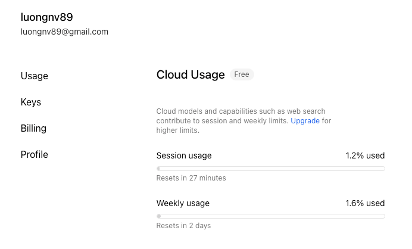

usage remain after 1 prompt


## Option 5: Cloud Provider APIs

**Time:** 2 minutes | **Cost:** Pay-per-use | **Best for:** Direct API access, more control

Sometimes you want to use the provider APIs directly. Here are the configs — save to `~/.claude/settings.json`:

### OpenRouter — Access Everything

Universal adapter for AI APIs. One key, many providers.

```
export ANTHROPIC_BASE_URL=https://openrouter.ai/api
export ANTHROPIC_AUTH_TOKEN=YOUR_OPENROUTER_KEY
export ANTHROPIC_API_KEY=# must be empty
export ANTHROPIC_MODEL="openai/gpt-oss-120b:free"
```

Press enter or click to view image in full size

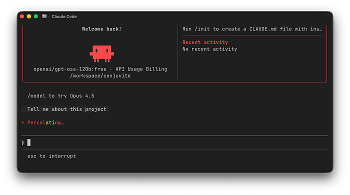

openai/gpt-oss-120b in Claude Code

The empty `ANTHROPIC_API_KEY` is intentional — prevents Claude Code from trying to authenticate with Anthropic directly. ([Source](https://openrouter.ai/docs/guides/guides/claude-code-integration))

### Minimax

The quality is good and the price is ridiculous (~98% cheaper than Opus 4.5).

```
export ANTHROPIC_BASE_URL=https://openrouter.ai/api
export ANTHROPIC_AUTH_TOKEN=<MINIMAX_API_KEY>
export ANTHROPIC_MODEL="MiniMax-M2.1"
```

Press enter or click to view image in full size

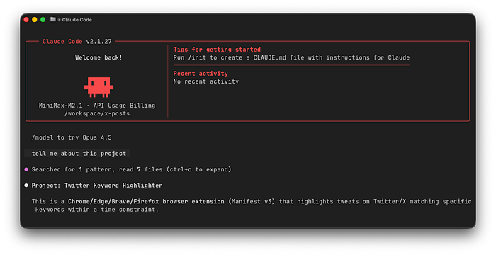

minimax-m2.1 via api_key

With similar configuration, you can do the same for GLM, Deepseek or Kimi. The most important are: **ANTHROPIC_BASE_URL, ANTHROPIC_AUTH_TOKEN, ANTHROPIC_MODEL and ANTHROPIC_API_KEY**


## Wrapping Up

**The main takeaway:** Claude Code is surprisingly flexible. You’re not locked into Anthropic’s API.

If you need complete privacy with a local model, then on a Mac M1 (32 GB) it is okay to work with *devstral‑2‑small (24B)*, but bellow that it is quite slow.

If you have an Nvidia DGX Spark, then there are plenty of choices.

If you prefer fast, high quality and have no problem with privacy, then cloud providers are a very good option. You can test Ollama Cloud with a free tier (quite OK for some emergency tasks). Otherwise go with Kimi, Minimax, Deepseek, or GLM, which have much cheaper prices.

However, if you still need decent quality, at the moment I think Opus 4.5 is still the best (quality + speed).

Let me know what setups you’re using.

*If you want to learn more about how to use Claude Code, you can check this Github repo.*

Press enter or click to view image in full size

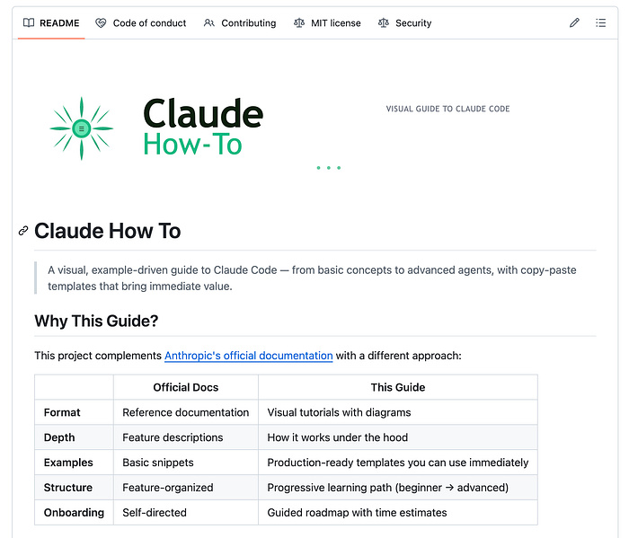

https://github.com/luongnv89/claude-howto


## Resources

**Getting Started:**

- [Ollama Claude Code Integration](https://docs.ollama.com/integrations/claude-code)
- [Unsloth Claude Code Guide](https://unsloth.ai/docs/basics/claude-codex)
- [OpenRouter Integration](https://openrouter.ai/docs/guides/guides/claude-code-integration)