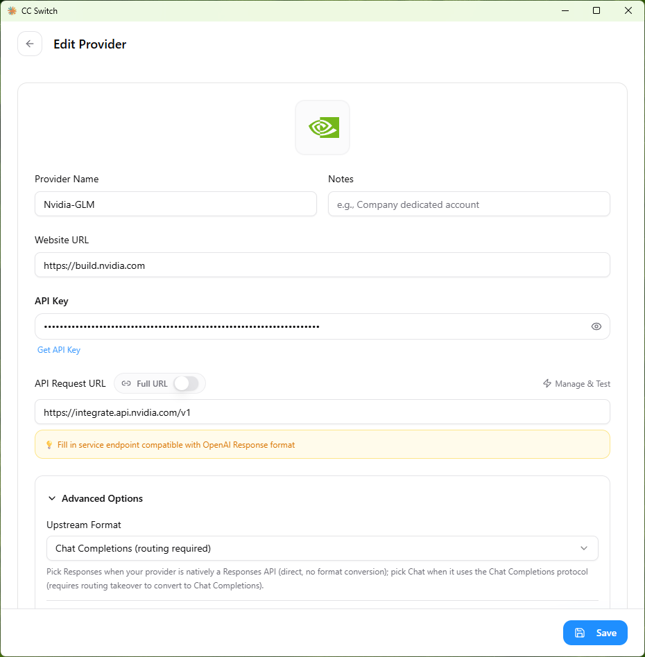
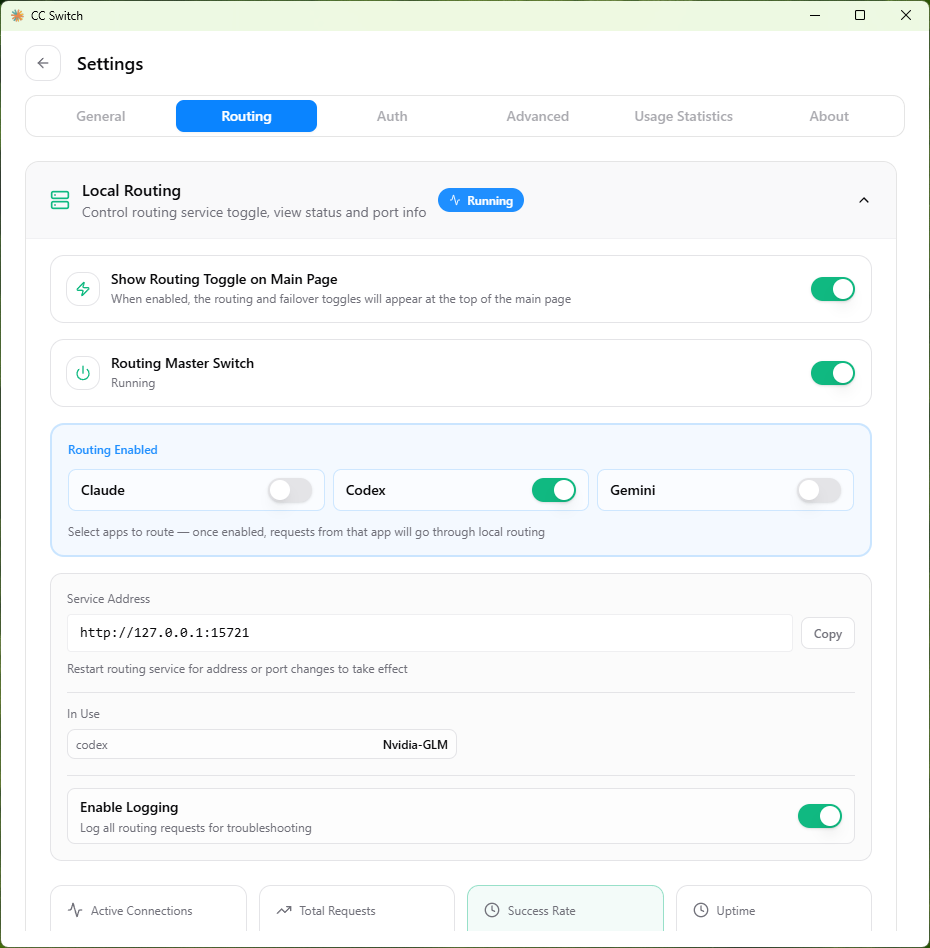
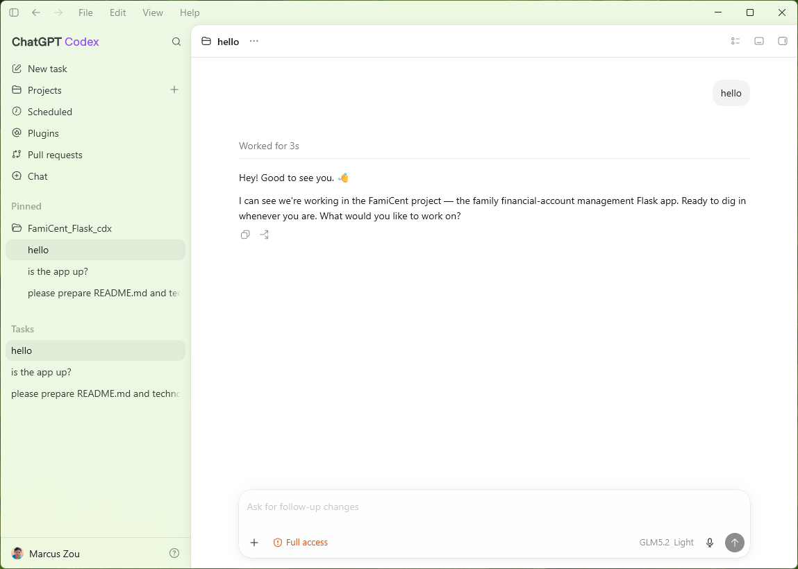

# Claude or Codex with CC-Switch and Free Models


## 1- Install Claude Code, Codex CLI, or Agy CLI, even OpenCode CLI

```shell
## Claude Code
### npm way
npm install -g @anthropic-ai/claude-code
### Linux/macOS/WSL
curl -fsSL https://claude.ai/install.sh | bash
### Windows
irm https://claude.ai/install.ps1 | iex
### Manually add the Env variable to $Path: 
### C:\users\<username>\.local\bin

## Codex CLI
### npm way
npm install -g @openai/codex
### Linux/macOS/WSL
curl -fsSL https://chatgpt.com/codex/install.sh | sh
### Windows
powershell -ExecutionPolicy ByPass -c "irm https://chatgpt.com/codex/install.ps1 | iex"

## Agy CLI
### Linux/macOS/WSL
curl -fsSL https://antigravity.google/cli/install.sh | bash
### Windows
irm https://antigravity.google/cli/install.ps1 | iex

## OpenCode CLI
### npm way
npm install -g opencode-ai
### Linux/macOS/WSL
curl -fsSL https://opencode.ai/install | bash
### Windows
scoop install opencode
```


## 2- Install CC-Switch

Current version 3.19.2 and go to download: [Releases · farion1231/cc-switch](https://github.com/farion1231/cc-switch/releases); 

This is the best option so far.

Or even a CLI based CC-Switch, definitely this is a CLI fork of [CC-Switch](https://github.com/farion1231/cc-switch).

```shell
curl -fsSL https://github.com/SaladDay/cc-switch-cli/releases/latest/download/install.sh | bash
```

There are many commands to remember though, please refer to README.md at https://github.com/saladday/cc-switch-cli

Or Kilo CLI:

```shell
## npm way
npm install -g @kilocode/cli
## bash way
curl -fsSL https://kilo.ai/cli/install | bash
```


##  3- Configure CC-Switch

Launch CC-Switch, 

If taking Codex as example, Click "ChatGPT" button, Click the "+" button at right corner, and select "Nvidia" or "Custom" for Agnes case; I provided the info below:

- Provider name: "**Nvidia-GLM**"
- Website URL: Optional, but i filled <https://build.nvidia.com>
- **API Key**: Must-have, copy the NIM API Key and paste here.
- **API Request URL**: must-have, it's https://integrate.api.nvidia.com/v1 for Nvidia case.
- Advanced Options:
  - -> Upstream Format: Please choose "**OpenAI Chat Completions**".
  - -> Scroll down to "**Fetch Models**", I chosen "**z-ai/glm-5.2**"
- Click "**Save**" button.



Then go back to the main GUI, and click the "Settings" icon, switch to "Routing" tab;

- "Local Routing" -> Turn on "Show Routing Toggle on Main Page" and "Routing Master Switch";

- Make sure the listen address is: 127.0.0.1 and the Listen Port is: 15721
- Click "Save" button

Back to main page, and click the Toggler button to turn on Routing. 
(If you go back to the Settings window, the "Codex" button shall be enabled).




## 4- Run Claude-App or Codex-App

Run the Codex App and it shall load up the GLM5.2 model automatically, if not, pick it up manually.

Simply  say "Hello" to the model, it shall return with a feedback really quick.




## 5- Special Report: Run Claude Code for Free with OpenCode Models

Claude speaks Anthropic. OpenCode Zen and OpenCode Go mostly speak OpenAI-compatible endpoints.

Link: [Claude Code + OpenCode Fee Models](./Claude-Code-Running-Against-Free-Models-of-OpenCode.md)


## Notes

- The config for Agnes 2.0 Flash LLM is same as above.
- The method works for Claude Code and Claude Desktop, but not the Gemini Flash/Pro Models.


## Credits

- Anthropic
- OpenAI
- CC-Switch

