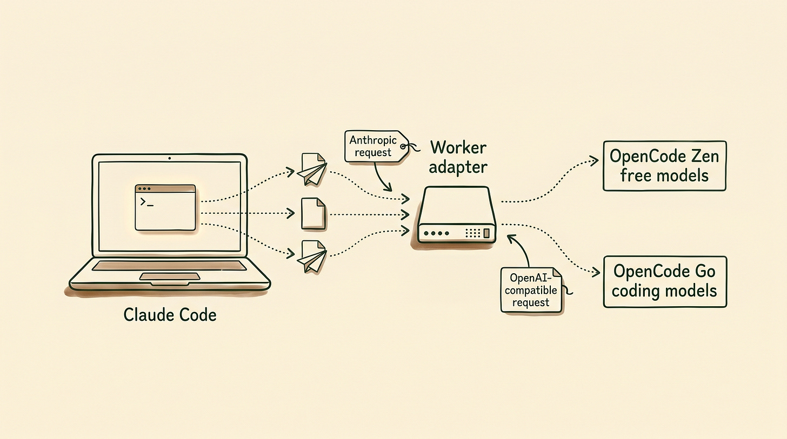
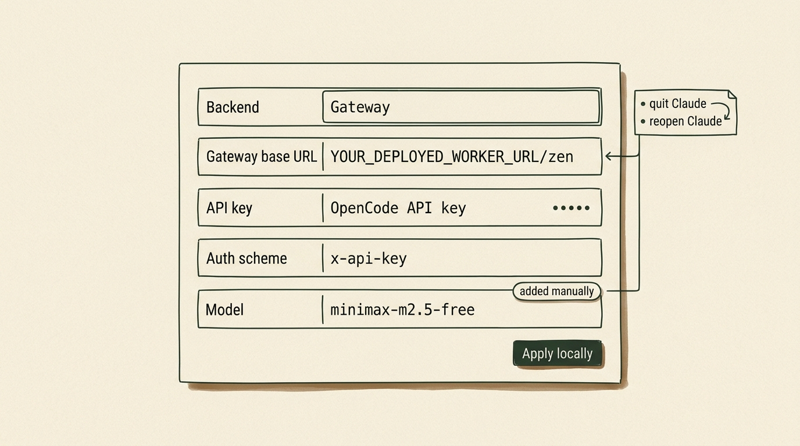
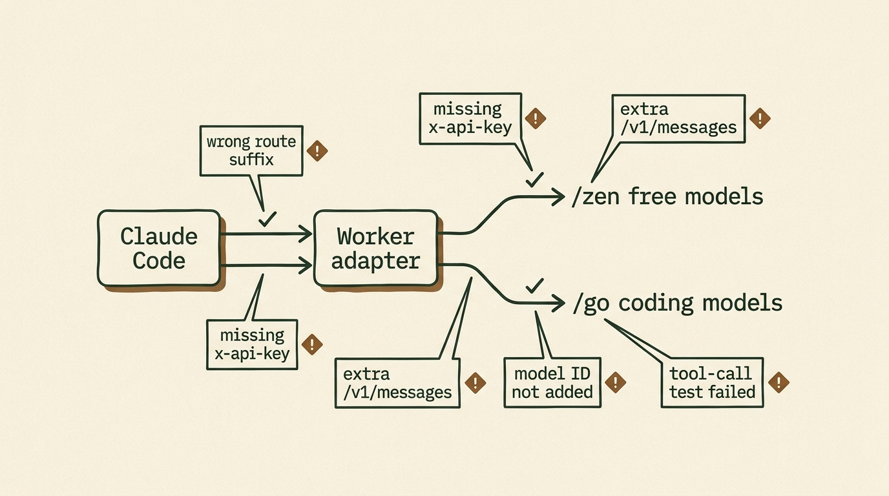

# Claude Code Runs Against Free Models of OpenCode

https://allagentsconsidered.substack.com/p/how-to-use-claude-code-for-free-with


Claude speaks Anthropic. OpenCode Zen and OpenCode Go mostly speak OpenAI-compatible endpoints.




So I built a translator.

The [OpenCode Cowork Proxy Worker](https://github.com/cucoleadan/opencode-cowork-proxy) lets Claude Code talk to OpenCode Go models and selected OpenCode Zen models. Claude keeps sending Anthropic-style requests, then the Worker translates them into the upstream format OpenCode expects.

No key storage. No message storage. Just a format bridge.

With that in place, you can start with free OpenCode Zen models like `minimax-m2.5-free`, then move to OpenCode Go’s subscription lane when the work gets more demanding.

I made the switch easy on purpose. You need a Cloudflare account and an OpenCode account. Both can start free, and you only upgrade if the workflow becomes worth it.


**Get the next proxy walkthrough before it eats your weekend. Subscribe to Vibe Stack Lab. I send practical AI workflows for builders who want control over the stack and fewer surprise bills.**

Subscribe


## In This Article:

1. How to install the Worker in your Cloudflare account
2. How to configure a third party gateway in Claude desktop
3. How to use Claude Code for free with OpenCode models
4. When to use `/zen` and when to use `/go`
5. The first safe test to run before touching a real repo
6. The setup mistakes that break this first


## Deploy the Worker in Cloudflare First

Before Claude can use OpenCode, you need a gateway URL it can call.

Open the [OpenCode Cowork Proxy Worker repo](https://github.com/cucoleadan/opencode-cowork-proxy) and click the **Deploy to Cloudflare Workers** button at the top. Cloudflare supports this one-click deploy flow directly for Workers projects, which is why this setup is fast to hand off.

Cloudflare walks you through the rest. When it finishes, copy your Worker URL.

At that point, your gateway is live.

Your deployed URL will look like your own Cloudflare Worker endpoint. In the examples below, I’ll call it:

```
YOUR_DEPLOYED_WORKER_URL
```

## Configure Claude Desktop to Use OpenCode Zen

Open Claude Desktop and go to the third-party inference setup.

If you’re on Windows, go to:

```
Help > Troubleshooting > Enable Developer Mode
```

Claude will restart and expose a new menu:

```
Developer > Configure Third-Party Inference
```

Anthropic’s current help docs for Claude Cowork’s third-party setup use this same path, so you’re not relying on a weird hidden hack here. You’re using the intended setup UI.

For your first test, point Claude at OpenCode Zen with the free model `minimax-m2.5-free`:

```
Backend: Gateway
Gateway base URL: YOUR_DEPLOYED_WORKER_URL/zen
API key: your OpenCode API key
Auth scheme: x-api-key
Model: minimax-m2.5-free
```

Once that’s done, make sure to add the model manually too:

```
minimax-m2.5-free
```

Click **Apply locally**. Fully quit Claude Desktop. Reopen it.

That’s the basic path for using Claude Code with a free OpenCode model through your Worker.




## Start with Free OpenCode Zen Models

Start with OpenCode Zen, not Go.

Zen is OpenCode’s curated model gateway. Some Zen models are paid. Some are free for a limited time while model teams collect feedback.

**Last updated: May 7, 2026**

The current [OpenCode Zen docs](https://opencode.ai/docs/zen/) list these free models:

```
minimax-m2.5-free
ling-2.6-flash
hy3-preview-free
nemotron-3-super-free
big-pickle
```

Use this first:

```
minimax-m2.5-free
```

Your base URL should end with:

```
/zen
```

Your model field should be:

```
minimax-m2.5-free
```

Free means free while OpenCode is offering that model under a free period. It does not mean no account, no API key, or no caveats.

You still need an OpenCode API key.

And you should absolutely check the privacy notes before using free models with sensitive work. As of May 7, 2026, OpenCode’s Zen docs say several free models may use collected data during the free period to improve the model. That includes `minimax-m2.5-free`. This is the exact opposite of the lane you want for sensitive code.

This is the test lane.

Use it for summaries, low-risk code review, documentation cleanup, and tiny file edits in a throwaway folder. Don’t start by pointing it at your main repo with write access.

On my own first tests, the free Zen route handled summaries, low-risk reviews, and tiny file edits fine, but I switched to `/go` as soon as I wanted stronger reasoning over a larger repo.

I wrote about the bigger reason open models matter in [Ditch Your Subscriptions and Run Open Source AI on Your Device](https://vibestacklab.substack.com/p/ditch-your-subscriptions-and-run). The short version is the same here: model choice gets more useful when your tools stop forcing the interface and the engine to stay married.


**Send this to the friend who pays for overlapping AI plans and still hits limits. It might save them a month of model roulette.**

[Share](https://allagentsconsidered.substack.com/p/how-to-use-claude-code-for-free-with?utm_source=substack&utm_medium=email&utm_content=share&action=share)


## Choose /zen for Free Models and /go for OpenCode Go

The proxy has two routes.

Use `/zen` for free models and Zen pay-as-you-go models:

```
YOUR_DEPLOYED_WORKER_URL/zen
```

Use `/go` for the monthly OpenCode Go subscription lane:

```
YOUR_DEPLOYED_WORKER_URL/go
```

If you want the fast mental model, use it like this:

- `/zen` is the free test lane
- `/go` is the stronger daily-work lane

As of May 7, 2026, the [OpenCode Go docs](https://opencode.ai/docs/go/) list Go at $5 for the first month, then $10 per month.

The same docs currently list these usage limits:

```
5-hour limit: $12 of usage
Weekly limit: $30 of usage
Monthly limit: $60 of usage
```

Your actual request count depends on the model.

Cheaper models stretch much further. Heavier models burn the limit faster.

The important privacy distinction is this: OpenCode Go says its providers follow a zero-retention policy and do not use your data for model training. That makes it a much better fit for real coding work than the free-model lane. I would still avoid calling anything “complete privacy,” but it is the safer route according to the current docs.

I covered OpenCode Go more broadly in [The $30 Hermes Stack That Makes Claude Max Look Like a Ripoff](https://vibestacklab.substack.com/p/the-30-hermes-stack-that-makes-claude). For Hermes, Go gives you a cheaper provider lane. With this proxy, Go becomes useful from Claude Code too.

## Why This Route Instead of OpenRouter or Ollama?

Because the point here is not just “find any cheaper provider.”

The point is keeping Claude’s interface and tool flow while swapping the model layer underneath it.

If you just want the fastest generic provider swap, OpenRouter is simpler.

If you want fully local inference, Ollama is a better answer.

If you specifically want Claude Code or Claude Cowork as the front end while OpenCode handles the models behind the scenes, this Worker route is the right tool.

That matters more than it sounds. A lot of people do not actually want a new interface. They just want a cheaper or more flexible inference lane behind the interface they already like.

If you want the broader comparison between Claude Cowork and other agent setups, I broke that down in [OpenClaw vs Claude Cowork vs Perplexity Computer - Which AI Agent Actually Fits Your Life](https://vibestacklab.substack.com/p/openclaw-vs-claude-cowork-vs-perplexity).

## Test Claude Code Safely in a Throwaway Folder

Don’t point this at your main repo first.

Create a throwaway folder:

```
claude-opencode-proxy-test
```

Add a file:

```
project-notes.md
```

Put fake project notes in it. No secrets. No client data.

Ask Claude Code:

```
Read project-notes.md.
Summarize the project in 10 bullets.
Create a second file called next-actions.md with a short implementation checklist.
Do not modify project-notes.md.
```

This checks whether routing and tool behavior work together. Claude has to create the new file from the notes without touching the original.

If that works, try a small code review:

```
Review this function for bugs.
Do not edit files yet.
Give me the risk list first.
```

I like that second test because it keeps the model away from edits until you see how it behaves.

After that, test one small tool-heavy task. Ask it to compare two files and create a short note. Keep the task boring.

You’re testing routing and tool behavior, not the model’s taste.

Free models are useful, but they need judgment. I wrote about that line between vibe coding and agentic engineering in [The Agentic Engineering Shift](https://vibestacklab.substack.com/p/the-agentic-engineering-shift).

## Switch to OpenCode Go When the Free Lane Stops Being Worth It

OpenCode Go is one of the more transparent AI subscriptions out there because the limits are expressed in dollar value, not in a vague “come back later” chat cap.

Switch to `/go` when the free Zen models are too weak, too slow, too rate-limited, or too risky for the work.

That usually happens when one of these becomes true:

1. You want better reasoning over a bigger codebase.
2. You want fewer caveats around data usage.
3. You are doing enough coding work that a $10 lane is cheaper than burning a premium subscription elsewhere.

The nice part is that the setup barely changes. You keep Claude as the interface. You just swap the route and the model.




I covered OpenCode Go in [The $30 Hermes Stack That Makes Claude Max Look Like a Ripoff](https://vibestacklab.substack.com/p/the-30-hermes-stack-that-makes-claude). For Hermes, Go gives you a cheaper provider lane. With this proxy, Go becomes useful from Claude Code too.

## How This Also Works with Claude Cowork

This is the part I care about more than the free model itself.

People like Claude Code and Claude Cowork because the interface feels good to use, and nobody wants another subscription with fuzzy limits hanging over every small coding session.

Claude Cowork especially has the kind of product polish that makes people want to stay inside it. The project view feels clean, the tool activity is easy to follow, and the whole thing feels closer to an app than a pile of agents you have to babysit.

The annoying part is paying for the whole Anthropic route every time you want that app experience.

I can justify premium reasoning models when I’m asking for difficult architecture help or reviewing a risky change. I do not want to burn premium usage on every small housekeeping task.

That’s why I built this proxy, and I want the compatibility point to be explicit: this route works with Claude Cowork too. You can keep Claude Cowork or Claude Code as the place where you work without needing Claude itself as the model route behind it.

The cheap path lets you keep the Claude app experience instead of forcing yourself into another interface.

You can start with a free OpenCode Zen model, then move to the $10 OpenCode Go lane when you want a stronger open model inside Claude Cowork or Claude Code.

I still like OpenCode. I still use Codex. Hermes is still where my serious recurring workflows live. The point is that Claude Cowork does not have to become another expensive subscription decision when OpenCode can provide the model layer for free or for far less.

If you want the shared-workflow version of that story, read [OpenClaw or Claude Cowork? Here’s How to Plug Both Into the Same Brain](https://vibestacklab.substack.com/p/openclaw-or-claude-cowork-heres-how).

## Use This 10-Minute Checklist to Get Started

1. Open the [OpenCode Cowork Proxy Worker repo](https://github.com/cucoleadan/opencode-cowork-proxy).
2. Click **Deploy to Cloudflare Workers** and install the Worker in your Cloudflare account.
3. Copy your deployed Worker URL.
4. Open Claude Desktop.
5. Enable Developer Mode, then open **Configure Third-Party Inference**.
6. Set the base URL to `YOUR_DEPLOYED_WORKER_URL/zen`.
7. Set auth scheme to `x-api-key`.
8. Paste your OpenCode API key.
9. Add `minimax-m2.5-free` manually.
10. Click **Apply locally**, fully quit Claude, then reopen it.
11. Run the throwaway-folder test.
12. Switch to `YOUR_DEPLOYED_WORKER_URL/go` and a Go model when you want the subscription lane.