# Configure MCP Servers for Claude Desktop Inside WSL

https://medium.com/primepartnerstech/configuring-claude-desktop-with-wsl-for-mcp-servers-1d2426b13e43

May 7, 2025

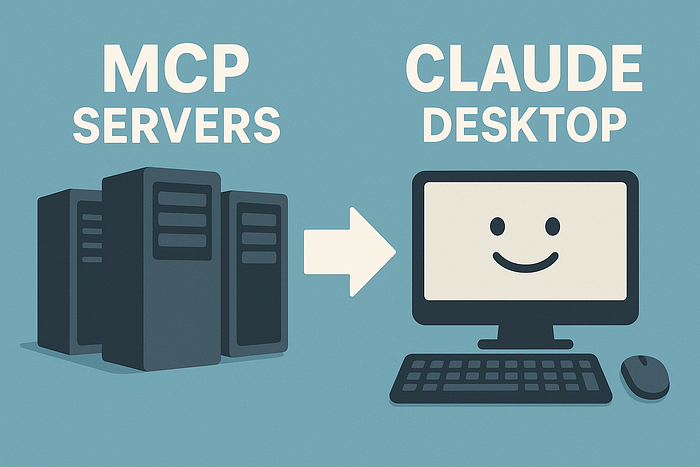

Generated with help from ChatGPT

**If you’re building AI workflows with Claude Desktop, chances are you’ve stumbled across Model Context Protocol (MCP) servers — the connective tissue for LLM and agentic AI tasks. But what if your setup isn’t the typical Mac or native Linux environment?**

As more developers shift to **Windows Subsystem for Linux (WSL)** for flexibility and cross-platform compatibility, the need for clear, working integrations has never been higher.

In this guide, I’ll show you how to **set up a local MCP server inside WSL**, connect it to **Claude Desktop**, and pull in real-time weather forecasts via a public API. No guesswork, no skipped steps — just a clean, reliable workflow you can build on.


## What You’ll Need

- **Claude Desktop** installed
- **WSL** (Windows Subsystem for Linux) setup
- Familiarity with basic Python tooling
- Approx. 15–20 minutes of focused time


**Step 1: Install Claude Desktop**

You need this to interact with the MCP tools running on your desktop or laptop locally.

Claude Desktop is a desktop application, created by Anthropic, that provides access to their Claude AI model. It allows users to interact with Claude in a more focused and potentially faster way than the web interface, and it includes features like working with large text submissions and generating code in common languages.

**I am using the sample code from the MCP documentation itself for some of the steps below**


**Step 2**: **Install** `uv` — **A Better Python Package Manager**

UV is a high-performance Python package and project manager written in Rust. It’s designed to be a faster and more efficient alternative to traditional tools like `pip`, `virtualenv`, and `pip-tools`. UV aims to be a single tool that handles various Python packaging tasks, including installing packages, managing virtual environments, and executing command-line tools.

If you are a python developer having dabbled with pip , pip3 , venv , virtualenv you will thank the developers of uv .

You can use WSL in your Windows Laptop for this command

```
curl -LsSf https://astral.sh/uv/install.sh | sh
```


**Step 3. Setup the MCP server project**

```
# Create a new directory for our project
uv init weather
cd weather

# Create virtual environment and activate it
uv venv
source .venv/bin/activate

# Install dependencies
uv add "mcp[cli]" httpx

# Create our server file
touch weather.py
```


**Step 4**: **Build** `weather.py`

Here’s a compact MCP server using the **National Weather Service API** to fetch alerts and forecasts.

```
"""
SERVER 
"""
from typing import Any
import httpx
from mcp.server.fastmcp import FastMCP

# Initialize FastMCP server
mcp = FastMCP("weather")

# Constants
NWS_API_BASE = "https://api.weather.gov"
USER_AGENT = "weather-app/1.0"

"""
HELPER FUNCTIONS
"""
async def make_nws_request(url: str) -> dict[str, Any] | None:
    """Make a request to the NWS API with proper error handling."""
    headers = {
        "User-Agent": USER_AGENT,
        "Accept": "application/geo+json"
    }
    async with httpx.AsyncClient() as client:
        try:
            response = await client.get(url, headers=headers, timeout=30.0)
            response.raise_for_status()
            return response.json()
        except Exception:
            return None

def format_alert(feature: dict) -> str:
    """Format an alert feature into a readable string."""
    props = feature["properties"]
    return f"""
Event: {props.get('event', 'Unknown')}
Area: {props.get('areaDesc', 'Unknown')}
Severity: {props.get('severity', 'Unknown')}
Description: {props.get('description', 'No description available')}
Instructions: {props.get('instruction', 'No specific instructions provided')}
"""

"""IMPLEMENT TOOL EXECUTION"""
@mcp.tool()
async def get_alerts(state: str) -> str:
    """Get weather alerts for a US state.

    Args:
        state: Two-letter US state code (e.g. CA, NY)
    """
    url = f"{NWS_API_BASE}/alerts/active/area/{state}"
    data = await make_nws_request(url)

    if not data or "features" not in data:
        return "Unable to fetch alerts or no alerts found."

    if not data["features"]:
        return "No active alerts for this state."

    alerts = [format_alert(feature) for feature in data["features"]]
    return "\n---\n".join(alerts)

@mcp.tool()
async def get_forecast(latitude: float, longitude: float) -> str:
    """Get weather forecast for a location.

    Args:
        latitude: Latitude of the location
        longitude: Longitude of the location
    """
    # First get the forecast grid endpoint
    points_url = f"{NWS_API_BASE}/points/{latitude},{longitude}"
    points_data = await make_nws_request(points_url)

    if not points_data:
        return "Unable to fetch forecast data for this location."

    # Get the forecast URL from the points response
    forecast_url = points_data["properties"]["forecast"]
    forecast_data = await make_nws_request(forecast_url)

    if not forecast_data:
        return "Unable to fetch detailed forecast."

    # Format the periods into a readable forecast
    periods = forecast_data["properties"]["periods"]
    forecasts = []
    for period in periods[:5]:  # Only show next 5 periods
        forecast = f"""
{period['name']}:
Temperature: {period['temperature']}°{period['temperatureUnit']}
Wind: {period['windSpeed']} {period['windDirection']}
Forecast: {period['detailedForecast']}
"""
        forecasts.append(forecast)

    return "\n---\n".join(forecasts)

"""INITIATE SERVER RUN"""
if __name__ == "__main__":
    # Initialize and run the server
    mcp.run(transport='stdio')
```


**Step 5: Configure Claude Desktop to Recognize Your MCP Server**

To add the MCP Server to your Claude Desktop configuration , you have to make an entry here.

Since this tutorial is intended for users with WSL , I referred the path in Windows style.

```
C:\Users\USERNAME\AppData\Roaming\Claude\claude_desktop_config.json
```

**Note :**

**a. Please change the username to your username appropriately**

**b. Always exit ( not close ) Claude Desktop after you make a change to the config file for it to take effect.**


In this file add the following details.

```
  "mcpServers": {
        "weather": {
            "command": "wsl.exe",
            "args": [
                "bash",
                "-c",
                "/home/USERNAME/.local/bin/uv --directory /mnt/c/Users/USERNAME/Desktop/Projects/weather run weather.py"
            ]
        }
    }
}
```

Let us also understand the parameters.

Press enter or click to view image in full size

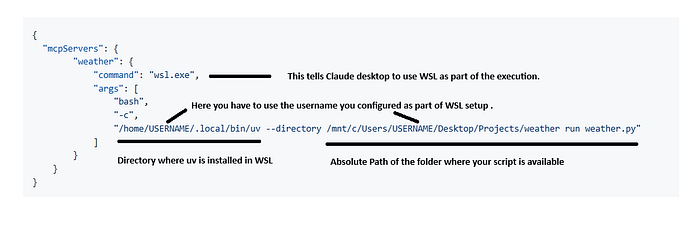

**Step 6: Test Your Setup**

**a. First check the settings in your Claude Desktop**

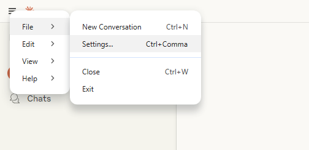

Claude Desktop Menu to access settings

Press enter or click to view image in full size

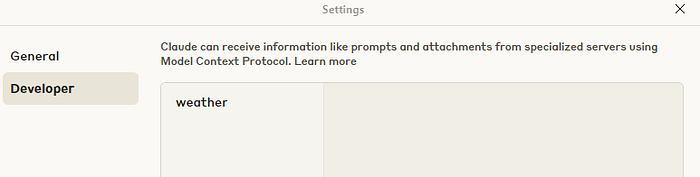

Developer Options showing the newly added MCP Server

**b. Click on the tools available**

Press enter or click to view image in full size

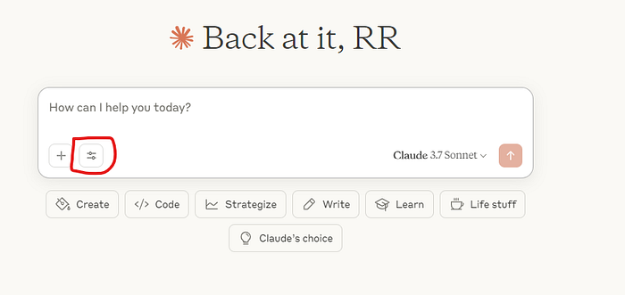

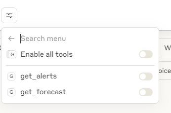

If you are able to verify until now , everything is looking fine to test. If something is not working , please check the steps patiently. Especially the WSL setup.


## Run a Test

**a.** Without enabling the tool, ask Claude for a weather forecast — it will return a static response.

Press enter or click to view image in full size

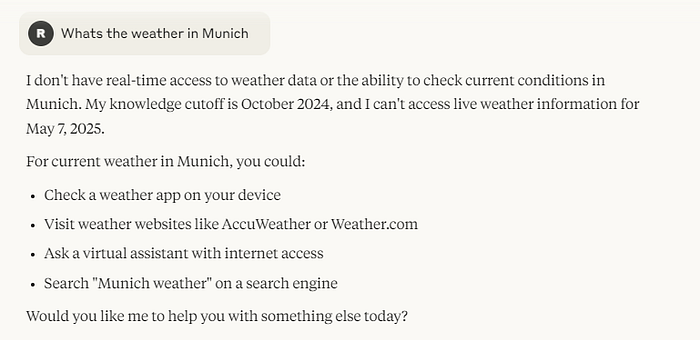

**b.** Now enable the tool and ask the same question.

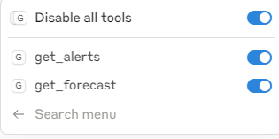

**c**. Claude will call your `get_forecast` function, hit the API, and return a live summary.

**Let’s break down the output**

**The model is calling the MCP tool helper function get_forecast**

Press enter or click to view image in full size

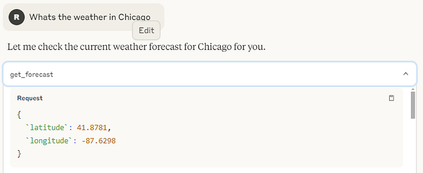

It uses the weather API definition that we setup in the weather.py and is getting a response.

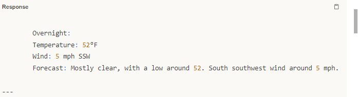

It then uses the model to create a readable summary for you.

Press enter or click to view image in full size

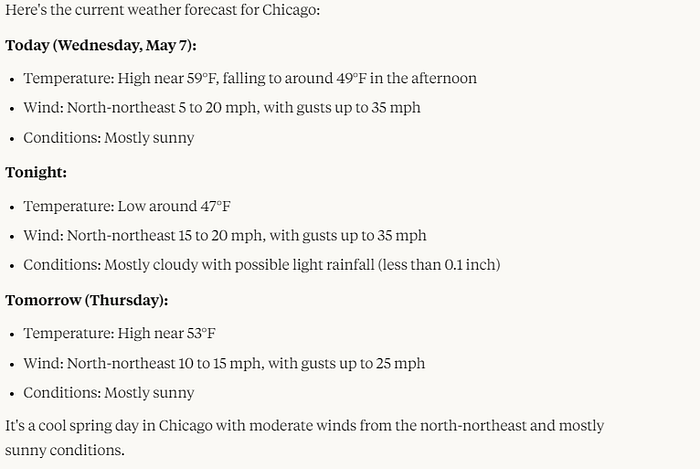

**Final Thoughts**

This workflow is a glimpse of how **Agentic AI** is bridging APIs and local tools for intelligent, context-aware automation. As WSL continues to grow in popularity among Windows-based developers, expect more integrations like this.

**Useful Links:**

- [Claude Desktop](https://claude.ai/download)
- [MCP Documentation](https://modelcontextprotocol.io/)
- [UV Python Project Manager](https://github.com/astral-sh/uv)
- [National Weather Service API](https://www.weather.gov/documentation/services-web-api)